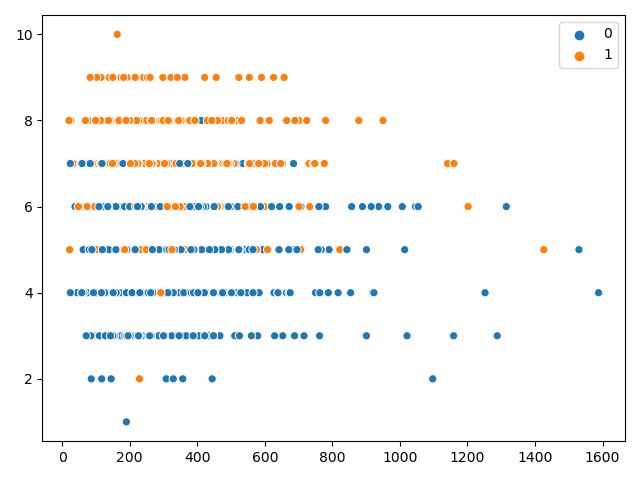
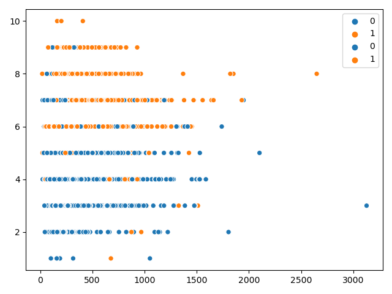
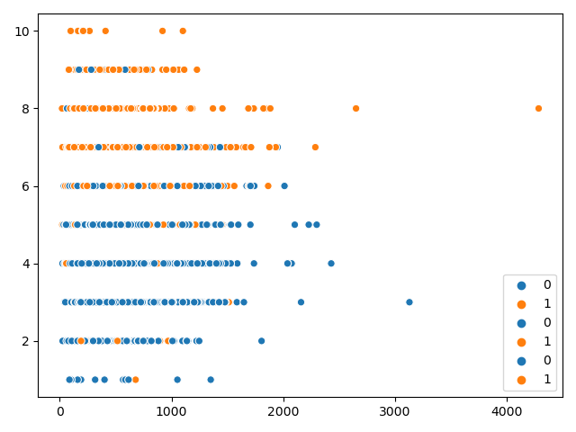
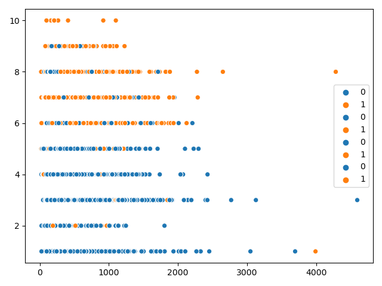

## **`verdict`** v/s Length of **`comments`** 2017

<table>
<thead>
  <tr>
    <th>2017</th>
    <th>2018</th>
  </tr>
  
</thead>
<tbody>
  <tr>
  <td>  </td>
  <td>  </td>
  </tr>
  
</tbody>
</table>

<table>
<thead>
  <tr>
    <th>2019</th>
    <th>2020</th>
  </tr>
  
</thead>
<tbody>
  <tr>
    <td>  </td>
    <td>  </td>
  </tr>
  
</tbody>
</table>

## Word Clouds

### 2017

<table>
<thead>
  <tr>
    <th>Accepted Papers</th>
    <th>Accepted Reviews</th>
  </tr>
  
</thead>
<tbody>
  <tr>
  <td>  </td>
  <td>  </td>
  </tr>
  
</tbody>
</table>

<table>
<thead>
  <tr>
    <th>Rejected Papers</th>
    <th>Rejected Reviews</th>
  </tr>
  
</thead>
<tbody>
  <tr>
    <td>  </td>
    <td>  </td>
  </tr>
  
</tbody>
</table>

### 2018

<table>
<thead>
  <tr>
    <th>Accepted Papers</th>
    <th>Accepted Reviews</th>
  </tr>
  
</thead>
<tbody>
  <tr>
  <td>  </td>
  <td>  </td>
  </tr>
  
</tbody>
</table>

<table>
<thead>
  <tr>
    <th>Rejected Papers</th>
    <th>Rejected Reviews</th>
  </tr>
  
</thead>
<tbody>
  <tr>
    <td>  </td>
    <td>  </td>
  </tr>
  
</tbody>
</table>
