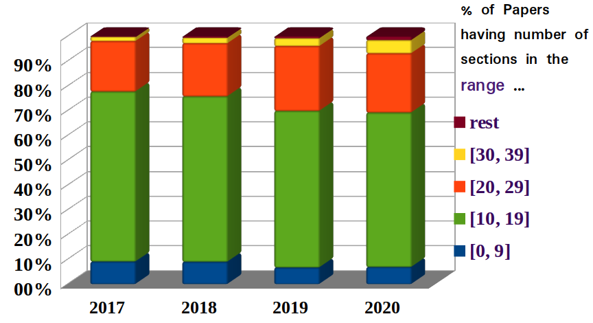
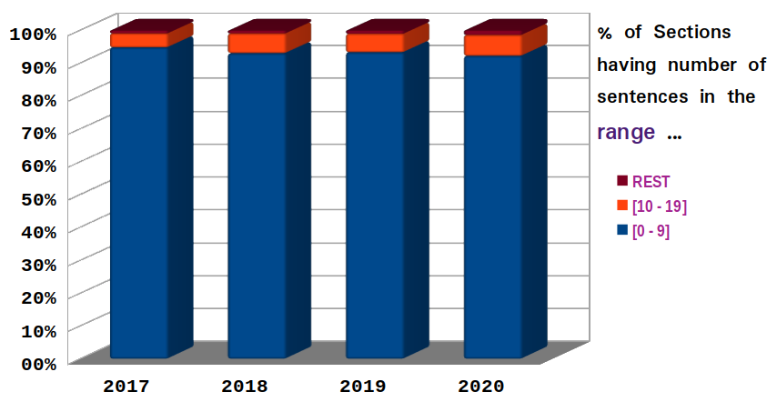

# PRAssist
Experimental Code of research paper PRAssist (under review)

## About Raw Data

Folder ```./raw``` contains compressed data files , which upon extraction will be the directories of dataset _(ICLR-17/18/19/20)_ . <br>EXtracted directory ```./raw/2017/``` will contain json files of two type ```(<id>.paper.json & <id>.json)``` , <br>where ```<id>.paper.json``` is the json of paper content and ```<id>.json``` is the json file that contains all three reviews and decision corresponding to that ```paper-id  <id>``` .
***

# How to run it ... ?

_We recommend using google colab to run it._
***

_Step 1_ :  **Download master-branch** of this repository [ zip file size : ~ 60 Mb ] & Go to **main folder** of it.

_Step 2_ :  **Make bash files executable**
```bash
chmod +x requirements.sh
chmod +x extractor.sh
chmod +x preprocessor.sh
chmod +x encoder.sh
chmod +x clear_year.sh
```
_Step 3_ :  **Run requirements.sh** to download all requirements.
```bash
./requirements.sh
```
_Step 4_ : **Run extractor.sh** to extract all compressed raw data files.
```bash
./extractor.sh
```
[_optional step_] : **Run get_stats.py** to generate statistics given in paper in table I.
```bash
python get_stats.py
```
_Step 5_ :  **Run preprocessor.sh** ,  takes around [10 - 15 min.] to preprocess all data.
```bash
./preprocessor.sh
```
_Step 6_ :  **Run encoder.sh** with year (2017 / 2018 / 2019 / 2020) in command line argument [~ 30 min.]  to generate embeddings , e.g.
```bash
./encoder.sh 2017
```
_Step 7_ :  Now models are ready to go, **run any of the two models**, run paper_rev_sentiment variant
```bash
python model_PRS.py 2017
```
or , paper_rev variant
```bash
python model_PR.py 2017
```
on ICLR-2017/18/19/20 Dataset.


[_optional step_] :  When **running low on memory** , clear embedding datas of the dataset which is not required further.
```bash
./clear_year.sh 2017
```
***
# Nsec & Nsent selection in Paper 

_Section Operator Analysis_


Upon analysing the datasets, We kept section operator **SEC**op = 30, which (according to the code) allowed **N**sec (maximum number of sections in a paper) to be in the range ( 0 , 2 x **SEC**op ). 

_Sentence Operator Analysis_


Similarly keeping sentence operator  **SENT**op = 10 allowed **N**sent (maximum number of sentences in a summarized section) to be in the range ( 0 , 2 x **SENT**op ) .

**Note** : Both of these graph's data has been generated by ```summaFlatten.py``` which is being run by ```encoder.sh```  .


**Note** : Any paper having more section that **N**sec or any summarized section having more sentences than **N**sent has gone through **_equipartition strategy_** which makes it a valid sample. 

**equipartition strategy** : We try to group items in the given input such that every group has approximately same number of items , and number of groups does not exceed a certain value.

***
